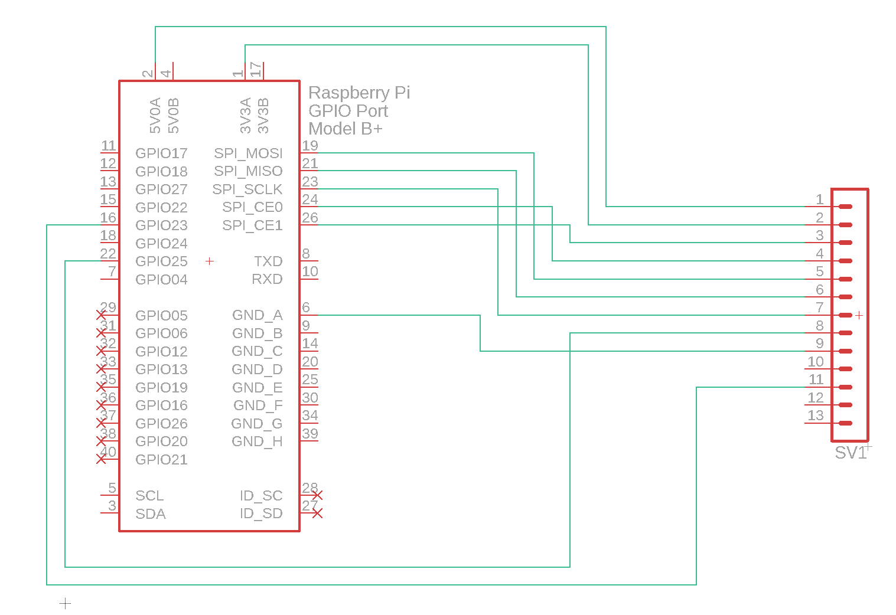

# pyPN5180
Python library for reading RFID tags using a PN5180 with a Raspberry Pi.

## Standards
Currently only implemented ISO15693

## Capabilities
- Read UID from card (Inventory Command).
- Read up to 16 cards at the same time, JUST BECAUSE YOU CAN (actually tested only with up to 3 cards).

## Known Limitations
- Support for ISO14443 missing
- Support for advanced commands
- Error detection and recovery (Oh yes, unfortunately it's missing)

## Requirements
Tested with Python 3.7 - Suggested use of virtual environment.

Libraries:
- spidev - https://pypi.org/project/spidev/
- RPi.GPIO - https://pypi.org/project/RPi.GPIO/
```
pip install spidev
pip install RPi.GPIO
```

## Wiring
